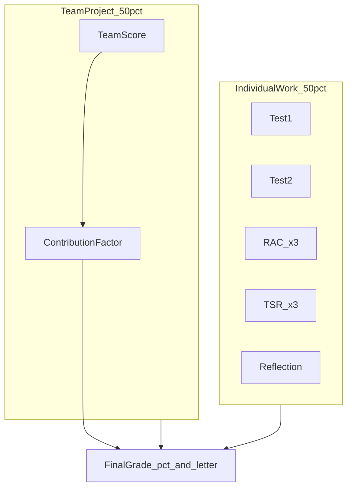

# CSE 115A Grade Calculator

## Confirmed Requirements

| Requirement | Decision |
|-------------|----------|
| Audience | Open tool for any CSE 115A student |
| Platform | Web app (browser, no install) |
| Weights | Configurable per quarter |
| Grade display | Current weighted grade + what-if projections, both as **percentage** and **letter grade** |
| Deployment | GitHub Pages |
| Term support | **Summer 2026** preset by default; user can switch/configure for other quarters |

## Current State

- Repo: [`/workspace`](/workspace) — only [`README.md`](/workspace/README.md) exists
- Remote: `github.com/freddie-chh/cse115a`
- Greenfield build — no existing code or dependencies

## Grading Model



**Individual (50%)**
- 2 tests, 3 RAC assignments, 3 TSRs, 1 reflection essay

**Team project (50%)**
- Team score adjusted by relative contribution multiplier (configurable)

Exact sub-weights vary by instructor/quarter — handled via **quarter presets** with editable overrides.

---

## Architecture

### Stack

- **React + Vite + TypeScript** — static SPA, fast dev, GitHub Pages compatible
- **Tailwind CSS** — clean UI with minimal custom CSS
- **Vitest** — unit tests for calculation logic
- **localStorage** — persist grades, selected quarter, and custom weight overrides
- **GitHub Actions** — build + deploy to GitHub Pages

### Quarter Preset System

Presets live in [`src/config/quarters/`](/workspace/src/config/quarters/) as typed config objects. Each preset defines:

- Quarter label (e.g., `"Summer 2026"`)
- Component list with default weights (must sum to 100%)
- Letter-grade cutoffs (UCSC standard by default)
- Team contribution factor range (default 0.8–1.2)

```typescript
// src/config/quarters/summer2026.ts
export const summer2026: QuarterPreset = {
  id: "summer-2026",
  label: "Summer 2026",
  components: [
    { id: "test1",       label: "Test 1",       weight: 12.5, group: "tests" },
    { id: "test2",       label: "Test 2",       weight: 12.5, group: "tests" },
    { id: "rac1",        label: "RAC 1",        weight: 5,    group: "racs" },
    // ... remaining components
    { id: "team",        label: "Team Project", weight: 50,   group: "team" },
  ],
  letterGrades: [
    { letter: "A",  min: 93 },
    { letter: "A-", min: 90 },
    // ... through F
  ],
  contributionRange: { min: 0.8, max: 1.2, default: 1.0 },
};
```

Users pick a quarter from a dropdown. Switching quarters resets weights to that preset (with confirmation if grades are entered). Users can edit individual weights in a settings panel; overrides persist in localStorage.

Adding a new quarter = adding one config file + registering it in [`src/config/quarters/index.ts`](/workspace/src/config/quarters/index.ts).

### Calculation Logic

Two modes in [`src/lib/calculate.ts`](/workspace/src/lib/calculate.ts):

**1. Current grade** (completed assignments only)
- Sum `(score × weight)` for entered components
- Divide by sum of weights for entered components
- Apply team score × contribution factor when team grade is entered
- Show: `"Current: 87.3% (B+)"` based on earned weight only

**2. What-if grade** (projected final grade)
- Treat unentered components as `"?"` placeholders
- Show projected grade assuming entered scores + configurable assumptions for missing ones (default: leave blank = excluded from projection, or user sets a hypothetical score)
- For each missing component, optionally show: `"Need 82% on Test 2 to reach A-"`
- Show: `"Projected: 91.2% (A-)"` when all fields filled or assumed

**Letter grade lookup**
- Map percentage to letter using active quarter's cutoff table
- Show both percentage and letter everywhere (summary card, what-if results, per-component hints)

```typescript
// Core formula
finalPct =
  sum(completedScore_i * weight_i) / sum(completedWeight_i)   // current mode
  // OR
  sum(allScore_i * weight_i)                                     // what-if mode (all filled/assumed)
teamContribution = teamScore * contributionFactor
// Team weight applied within the 50% team bucket
```

### File Structure

```
/workspace/
├── README.md
├── package.json
├── vite.config.ts              # base: '/cse115a/' for GitHub Pages
├── .github/workflows/deploy.yml
├── index.html
├── src/
│   ├── main.tsx
│   ├── App.tsx
│   ├── types/
│   │   ├── grade.ts            # GradeInputs, GradeResult
│   │   └── quarter.ts          # QuarterPreset, Component, LetterGrade
│   ├── config/
│   │   └── quarters/
│   │       ├── index.ts        # Registry of all presets
│   │       └── summer2026.ts   # Default preset
│   ├── lib/
│   │   ├── calculate.ts        # currentGrade(), whatIfGrade(), letterGrade()
│   │   └── letterGrades.ts     # Percentage → letter mapping
│   ├── components/
│   │   ├── Header.tsx
│   │   ├── QuarterSelector.tsx
│   │   ├── GradeForm.tsx       # Individual component inputs
│   │   ├── TeamGradeSection.tsx
│   │   ├── GradeSummary.tsx    # Current % + letter, projected % + letter
│   │   ├── WhatIfPanel.tsx     # "Need X% to reach Y" hints
│   │   └── RubricSettings.tsx  # Edit weights + letter cutoffs
│   └── hooks/
│       └── useGradeStorage.ts  # localStorage sync
└── tests/
    └── calculate.test.ts
```

---

## UI Design

```
┌─────────────────────────────────────────────────┐
│  CSE 115A Grade Calculator                      │
│  Quarter: [Summer 2026 ▾]                       │
├─────────────────────────────────────────────────┤
│  CURRENT GRADE          │  WHAT-IF PROJECTION   │
│  87.3%  (B+)            │  91.2%  (A-)          │
│  Based on 6/9 components│  If remaining = avg   │
├─────────────────────────────────────────────────┤
│  Individual Work                                │
│  Test 1        [  85  ] / 100    (12.5%)        │
│  Test 2        [  --  ] / 100    (12.5%)        │
│  RAC 1         [  92  ] / 100    ( 5.0%)        │
│  ...                                            │
├─────────────────────────────────────────────────┤
│  Team Project                                   │
│  Team Score    [  --  ] / 100    (50.0%)        │
│  Contribution  [====●====] 1.0x                 │
├─────────────────────────────────────────────────┤
│  What-If Hints                                  │
│  • Need 82% on Test 2 to reach A- (90%)         │
│  • Need 78% team score (at 1.0x) to reach B+    │
├─────────────────────────────────────────────────┤
│  ⚙ Edit Rubric Weights (collapsible)            │
└─────────────────────────────────────────────────┘
```

Key UX details:
- Percentage and letter grade shown side-by-side in summary
- Empty fields = not yet graded (excluded from current grade denominator)
- What-if panel calculates minimum scores needed per remaining assignment to hit target letter grades
- Rubric editor validates weights sum to 100% before saving
- Disclaimer footer: "Weights are estimates — verify with your syllabus"

---

## GitHub Pages Deployment

- `vite.config.ts`: `base: '/cse115a/'` (matches repo name)
- [`.github/workflows/deploy.yml`](/workspace/.github/workflows/deploy.yml):
  - Trigger on push to `main`
  - `npm ci && npm run build && npm run test`
  - Deploy `dist/` to `gh-pages` branch via `peaceiris/actions-gh-pages`
- Enable GitHub Pages from `gh-pages` branch in repo settings (one-time)

---

## Implementation Order

1. **Scaffold** — Vite + React + TS + Tailwind, GitHub Pages base path, Vitest
2. **Quarter presets** — types, Summer 2026 config, registry
3. **Calculation logic** — current grade, what-if, letter lookup + unit tests
4. **UI** — quarter selector, grade form, team section, summary (%, letter), what-if panel
5. **Rubric settings** — editable weights with validation, letter cutoff editor
6. **Persistence** — localStorage for grades, quarter selection, weight overrides
7. **Deploy** — GitHub Actions workflow, README with usage + how to add new quarter presets

---

## Risks and Mitigations

| Risk | Mitigation |
|------|------------|
| Wrong default weights | Editable rubric + README disclaimer + easy quarter preset addition |
| Team contribution formula varies | Expose as configurable multiplier, not hard-coded |
| GitHub Pages base path issues | Set `base` in vite.config.ts to match repo name |
| What-if math edge cases | Comprehensive unit tests for partial completion, zero weights, boundary cutoffs |
